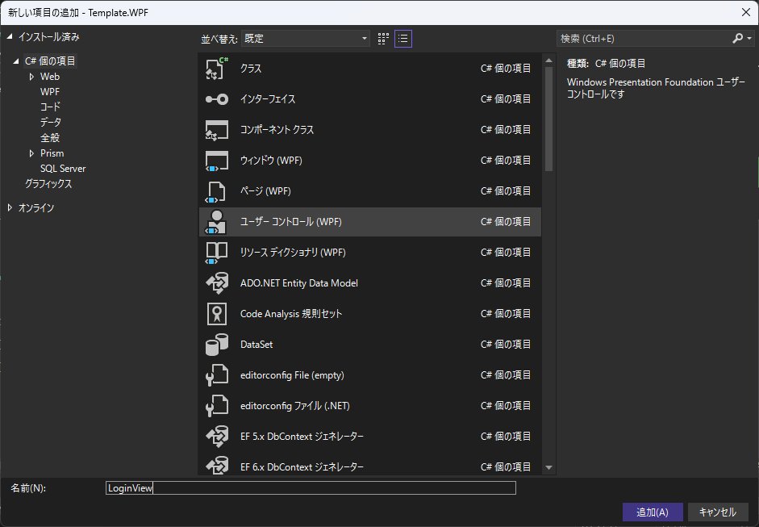

# View/ViewModel追加手順

# View作成

Viewsフォルダに、xxxViewという名称でユーザーコントロールを追加します。



# ViewModel作成

ViewModelsフォルダに、xxxViewModelという名称でクラスを追加します。


# ViewModel初期設定

アクセシビリティをinternalからpublicへ変更し、INotifyPropertyChangedを継承します。

```csharp
public class LoginViewModel : INotifyPropertyChanged
{
    public event PropertyChangedEventHandler? PropertyChanged;
}
```

# View初期設定

Viewのコードビハインドで、DataContextを設定します。

```csharp
public LoginView(LoginViewModel viewModel)
{
    InitializeComponent();
    DataContext = viewModel;
}
```

※xamlから適用するパターンはDIの関係から使用できない

# DI登録

App.xaml.csのConfigureServicesでView/ViewModelそれぞれDI登録します。

services.AddSingleton<xxx>();だと一度生成されたインスタンスを使いまわすため、別画面に遷移してもプロパティの値などが保持されます。

services.AddTransient<xxx>();だと使用するたびに新しいインスタンスを生成するため、変数などが毎回リセットされます。

```csharp
private void ConfigureServices(HostBuilderContext context, IServiceCollection services)
{
    //Service登録
    services.AddHostedService<ApplicationHostService>();
    services.AddSingleton<ContentNavigationService>();
    services.AddSingleton<MessageService>();

    //View / ViewModel登録
    //AddSingleton: 一度生成されたインスタンスを使いまわす
    //AddTransient: 使用するたびに新しいインスタンスを生成する
    services.AddTransient<MainWindow>();
    services.AddTransient<MainWindowViewModel>();
    services.AddTransient<HomeView>();
    services.AddTransient<HomeViewModel>();
    services.AddTransient<LoginView>();
    services.AddTransient<LoginViewModel>();
}
```