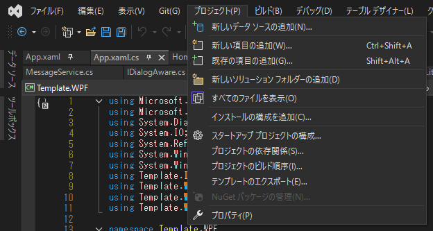
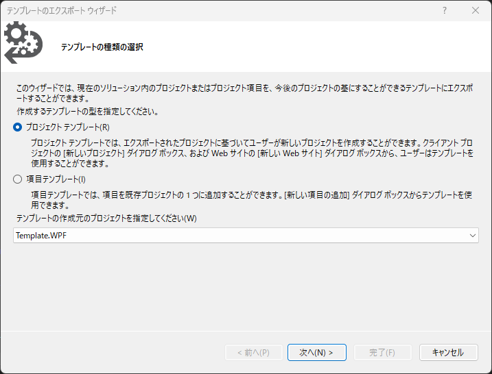
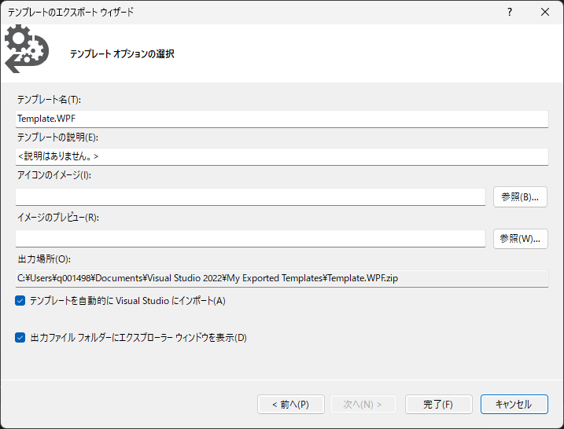

# Templateについて
WPFでMVVMを使ってアプリケーションを作成するにあたり、最低限必要な機能を実装したテンプレートです。
機能追加希望やバグ報告は、Issuesからbutやenhancementのタグをつけてコメントしてください。

## Visual Studioでの使用方法

### プロジェクトから出力する場合

「プロジェクト」から「テンプレートのエクスポート」を選択し、プロジェクトテンプレート、作成元プロジェクトを一つずつ選択し完了を選択します。
(3つのプロジェクトを出力するため3回同じ手順が必要です)
テンプレートを自動的にVisual Studioにインポートにチェックが入っていると、新しいプロジェクトの作成時に、テンプレートとして使用できるようになります。

### 出力済みのプロジェクトを読み込む場合

Zip形式のプロジェクトテンプレートファイルを特定のフォルダに保存し、Visual Studioを立ち上げることで自動的に読み込まれ、新しいプロジェクトの作成時に、テンプレートとして使用できるようになります。

C:\Users\ユーザ名\Documents\Visual Studio 2022\My Exported Templates

https://learn.microsoft.com/ja-jp/visualstudio/ide/how-to-update-existing-templates?view=vs-2022
